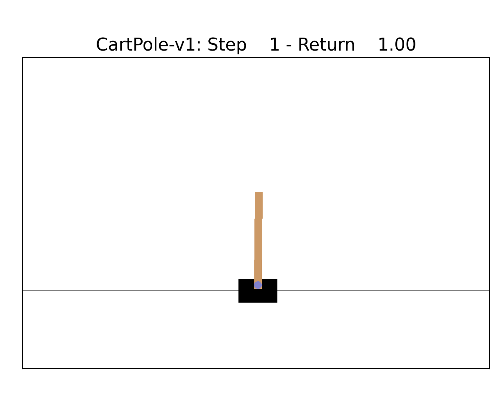

# DTPO: Optimizing Interpretable Decision Tree Policies for Reinforcement Learning

DTPO is an algorithm that combines the gradient-based Proximal Policy Optimization (PPO) algorithm with non-differentiable decision trees to train interpretable policies. This repository also contains implementations of:
- DQN, neural network-based algorithm for reinforcement learning
- PPO, proximal policy optimization with neural networks
- VIPER, learning decision trees for reinforcement learning by imitating a DQN

We ported several environments to [Gymnax](https://github.com/RobertTLange/gymnax) which integrates well with our [JAX](https://github.com/google/jax)-based implementation.

## Installation

We developed DTPO in Python 3.9 but versions >=3.7 should work as well. All required packages can be installed using:
```
pip install -r requirements.txt
```
We recommend using virtual environments. Dependencies such as pytorch are only used for the other implementations as DTPO is based on JAX.

## Running the experiments

To run a model on one of our implemented environments run the appropriate `run_dtpo.py`, `run_viper.py`, `run_ppo.py` or `run_dqn.py` script. You can find out about the supported options by running:
```
python run_dtpo.py -h
```

We also provide shell scripts that run all models and environments that we used in the experiments sequentially: `run_all.sh` and `run_size.sh`. After running these scripts you can run `plot_results.py` and `plot_size.py` respectively to generate the plots and tables.

## Policy visualization

To visualize a trained policy run:

```
python visualize_policy.py ENV_NAME PATH_TO_MODEL_PARAMS
```

This is only supported for the environments that have rendering modes in `gymnax` and unfortunately requires downgrading to `gym==0.19.0` and `pyglet==1.5.27` for now. It will can create gifs such as (CartPole-v1 left, CartPoleSwingup right):

| CartPole-v1                                            | CartPoleSwingup                                                |
|--------------------------------------------------------|----------------------------------------------------------------|
|  |  |


# CSE3000 Research Project - Contributions

NOTE: The original DTPO repository made by Daniël Vos can be found [here](https://github.com/tudelft-cda-lab/DTPO).

This repository was extended as part of the Bachelor's CSE Research Project at Delft University of Technology to support interpretable reinforcement learning in continuous action environments.
The key contributions of this extension are:

1. <b>Continuous Action Support (DTPO-c)</b>
    - A new variant of DTPO, called DTPO-c, which is able to handle continuous action spaces directly by outputting Gaussian distribution parameters per action dimension.
2. <b>Discretization Study</b>
    - Analysis of DTPO performance in continuous control tasks by discretizing the action space for varying action resolutions.
3. <b>Benchmarking against neural network RL</b>
    - A comparison of DTPO-c against Robust Policy Optimization (RPO) on the Pendulum-v1 environment.

The full thesis can be found at the [TU Delft Repository](http://repository.tudelft.nl/), titled as:

<b>"Interpretable Reinforcement Learning for Continuous Action Environments: Extending DTPO for Continuous Action Spaces and Evaluating Competitiveness with RPO"</b> - Misha Kaptein, 2025

## Running the Experiments
In the shell script `run_experiments.sh`, all the commands that were used for running the experiments can be found.

### DTPO-c Algorithm

To train DTPO-c on the Pendulum-v1 environment, run the following command:
```
python run_dtpo_continuous_action.py --env-name Pendulum-v1 --max-leaf-nodes 32 --simulation-steps 10000 --max-iterations 2000
```

### Discretization Study

To run an example command performed during the discretization study on the discretized Pendulum-v1-BangBang environment:
```
python run_dtpo.py --env-name Pendulum-v1-BangBang --output-dir out --seed 1 --num-discrete-actions 5
```

### Comparison with RPO

For the comparison of DTPO-c against RPO, the results of running RPO ([rpo_continuous_action.py](https://github.com/vwxyzjn/cleanrl/blob/master/cleanrl/rpo_continuous_action.py)) for three different seeds (1, 2, and 3) from the [CleanRL](https://github.com/vwxyzjn/cleanrl) library have been used and saved in the `logs_rpo_continuous` directory. 
After running DTPO-c over multiple seeds, the comparison plots are created by running the `plot_comparison.py` script.